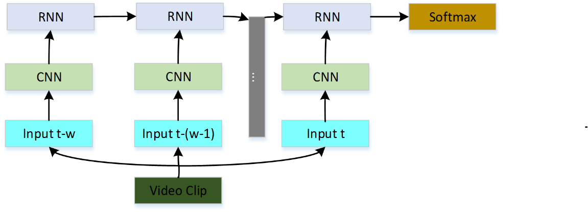

# About Codes

All the codes are writen in python. For the terrible support of the latex in the github, you could install the plug-in "Github With MathJax" in the Chrome to see the math formula in the mardown file.

If you have any problems, please feel free to contact me:)

​					Fig.1 Video Classification

## Environment

- Python3.5

- tensorflow 1.1

- ffmpeg

- librosa

  and for other python packages, you can use `pip install package-name ` whenever there comes up a `ImportError`.

## How to use

- login in the linux server via ssh

- change the working directory:  `cd /home/ubuntu/Documents/jialin/src/bilibili`

- activate the python environment: `source activate tensorflow-gpu`	

- extract the frames : `python extract_frame.py`

- save the frames to the hdf file: `python frame_to_h5.py`

- extract the CNN feature(fc7) and save to the hdf file: `python extract_fc7.py`

- Use the LSTM to classify the video: `python video_clf_lstm.py`

  And now you can just run the last step :  `python video_clf_lstm.py`, you will see the training accuracy should be 1.00(i.e. 100%), which means overfitting.

  ***Note:*** when you want to training in a normal mode instead of the overfitting mode, you had better change the "batch generation function" in the train_network function in the file video_clf_lstm.py. 

## Code Guide

#### Rename the video file

rename_file.py:  because the video files' names are all in characters,  it is necessary to rename the file according to their video id.

***this should be already been done, you can just leave it alone.***

#### Extract the image frames and the audio clips from the video file

extract_frame.py: extract the image frames from the video file , also log  the errors when extracting. 

***in this step, you can just type `python extract_frame.py` for extracting images.***

#### Preprocess the data

extract_fc7.py: extract the fc_7 feature of the image frames ad save them to the hdf file.

frame_to_h5.py: load the image and save them to the hdf file

#### Classification

video_clf_lstm.py: video classification , the framework is CNN+LSTM  as Fig.1.

#### Modal Discussion:

[some detailed discussion about the model implementation](https://github.com/wangjialin114/VideoEmotion/blob/master/Model%20Discussion.md)

## TODO

- Save the data in the TFRecords format instead of the hdf file. Maybe more efficient and convenient for the tensorflow data feeding.